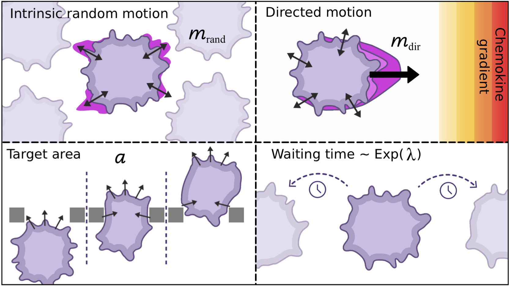

# Simulation-Based Inference of Cell Migration Dynamics in Complex Spatial Environments

authors: [J. Arruda, E. Alamoudi, R. Mueller, M. Vaisband, E. Kiermaier, J. Hasenauer]
 

## Introduction

This repository contains the code, Morpheus model configuration file for simulating cell migration within environment of structural obstacles and experimental data.

The model is built to explore how cell populations respond to chemokine gradients and physical boundaries, using a Cellular Potts Model (CPM) and persistent motion dynamics.

## Description

- 2D Cellular Potts Model  
- Chemokine Gradient: Gaussian profile centered around a virtual source  
- Initial Cell Distribution: Random circular placement near one-third the grid height  
- Motion Behavior:
  - Persistent random walk with exponential waiting times (tumbling)
  - Chemotaxis toward a static Gaussian chemokine field
- Strucutral obstacles are read from a TIFF image mask
- Logging of cell position every 30 time steps

## Results

We integrated experimental observations of dendritic cell migration in a geometrically constrained microenvironment with a calibrated Cellular Potts Model 
and demonstrate that these spatial constraints modulate motility dynamics, including velocity and directional changes.
We show that classical summary statistics used in approximate Bayesian computation (ABC)—such as mean squared displacement and turning angle distributions—can resolve key mechanistic features, 
however fail to extract richer spatiotemporal patterns.
Instead, we apply neural posterior estimation (NPE) with neural network based summary features, which outperform handcrafted statistics.
This learned summary representation of the data enables robust and flexible parameter inference, providing a data-driven framework for model calibration and advancing the quantitative analysis of cell migration in structured microenvironments.

## Reference

_To be added — citation or publication link forthcoming._
